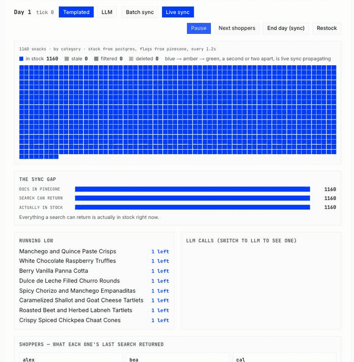

# Build a Snack Shop's Search Engine with Pinecone and Postgres

A Next.js sample app simulating a snack shop showing Postgres as the system of record and Pinecone as a derived, rebuildable search index, connected by nothing but a list of IDs.

[](https://vercel.com/new/clone?repository-url=https://github.com/pinecone-io/postgres-snack-search&env=PINECONE_API_KEY,DATABASE_URL&envDescription=Pinecone%20API%20key%20and%20a%20Postgres%20connection%20string&envLink=https://github.com/pinecone-io/postgres-snack-search#quickstart)



*Live sync mode: shoppers empty the shelves while `docs in pinecone` holds at 1,160. Blue squares turn amber the moment a snack sells out, then green a second later once Pinecone's `in_stock` flag lands — that amber gap is the index's real propagation delay.* 

The app comes complete with a hybrid search for recommending snacks to hungry buyers, as well as a simulation of buyers hitting Pinecone + Postgres during a shopping day. The app even handles syncing between Pinecone and Postgres, and is a great way to learn how to implement something similar in your app.

Deploy the app yourself to Vercel below, or pull the app repo and remix it for your own purposes.

## Quickstart

You need a Pinecone API key and a Postgres database. No Python, no extra tooling.

Examples of Postgres databases you can use are Supabase, Neon, etc. As long as you have a DATABASE_URL, you can interface with your service via Drizzle.

```bash
npm install
cp .env.example .env      # fill in PINECONE_API_KEY and DATABASE_URL
npm run setup             # ~2 minutes: creates the index, embeds, seeds Postgres
npm run dev               # http://localhost:3000
```

Re-running `npm run setup` is safe. Edit `snacks.jsonl` and re-run it to reload the catalog.

### Environment

| Variable | Required | What it's for |
| --- | --- | --- |
| `PINECONE_API_KEY` | yes | From [app.pinecone.io](https://app.pinecone.io) |
| `DATABASE_URL` | yes | Any Postgres — Supabase, Neon, or local |
| `GEMINI_API_KEY` | no | The "LLM" shopper brain and `npm run generate:snacks`. Without it, shoppers use fixed phrases |
| `SEED_STOCK_QTY` | no | Units per snack after a Restock. Unset gives a realistic 5–40; `1` makes the first shopper to pick something sell it out, which is the fastest way to see the sync modes differ |

## Deploying

[](https://vercel.com/new/clone?repository-url=https://github.com/pinecone-io/postgres-snack-search&env=PINECONE_API_KEY,DATABASE_URL&envDescription=Pinecone%20API%20key%20and%20a%20Postgres%20connection%20string&envLink=https://github.com/pinecone-io/postgres-snack-search#quickstart)

Stock Next.js deploy — set `PINECONE_API_KEY` and `DATABASE_URL`. Four things to know:

- **Run `npm run setup` locally first**, pointed at the same database and index the deployment will use. Index creation and seeding aren't part of the build; skip this and the shop comes up empty.
- **Use a pooled connection string.** Serverless opens many short-lived connections, and `/shop` polls every 1.2s per open tab. On Supabase that's the `*.pooler.supabase.com` string; keep the direct one for `npm run db:push`.
- **The mutating endpoints have no auth.** Anyone who finds a public deployment can press Restock, which rebuilds all 1,160 documents in whatever index you pointed at. Use a throwaway project and index for anything public.
- **Restock works on a deployment; `npm run db:seed` doesn't.** Restock rebuilds the index from the `snacks` table, embedding each row on the way in (about 13 embed calls), touching no files. `db:seed` reads the gitignored 23MB prepared file, so it stays a local step.

## Pages

- **`/`** — landing page
- **`/snacks`** — search the catalog: semantic, keyword, or hybrid, with live price and stock
- **`/shop`** — the day/night simulation. Shoppers buy against live Postgres stock while search runs against a Pinecone index that's allowed to fall behind. Switch between **Batch sync** (the index catches up once a day) and **Live sync** (a sellout writes an `in_stock` flag immediately). Night sync is still what actually deletes a sold-out document in both modes — the `in_stock` flag hides it from search without removing it.

## Scripts

Look here for exactly how to rebuild the app, indexes, or modify key parameters.

| Command | What it does |
|---|---|
| `npm run dev` | Start the app |
| `npm run setup` | First-run setup — chains the three below |
| `npm run setup:index` | Create the Pinecone index, embed 1,160 snacks, write `snacks-for-pinecone.jsonl` |
| `npm run db:push` | Push `src/db/schema.ts` to Postgres |
| `npm run db:seed` | Build the catalog from the prepared file and upsert every document |
| `npm run stock -- <n>` | Set every snack's stock to `n`, Postgres only. For the starting state prefer `SEED_STOCK_QTY` — a Restock overwrites whatever this set |
| `npm run generate:snacks` | Generate more snack descriptions via Gemini (extends `snacks.jsonl`) |
| `npm run lint` | Lint |
| `npm test` | Unit tests — 44 pure tests, no network, no credentials |
| `npm run test:db` | Against real Postgres. Skipped without `DATABASE_URL` |
| `npm run test:contract` | Against the real Pinecone index. Skipped without `PINECONE_API_KEY` |
| `npm run test:all` | All three, in order |

## Tests

Three suites, split by what they need:

- **`npm test`** — pure functions, no credentials. Must always pass. Nothing in it may import a module that reads `env` at load time.
- **`npm run test:db`** —  Postgres tests
- **`npm run test:contract`** —  Pinecone tests

## Project layout

```
src/db/          schema, queries, the two fill operations (buildCatalog / restockShelves)
src/lib/         snacksPinecone.ts (all Pinecone access), simulation.ts, shopperBrain.ts,
                 rrf.ts + shopView.ts (pure logic, credential-free so tests can import it)
src/app/api/sim/ the shop's endpoints: tick, night-sync, next-day, reset, state, catalog, index-flags
src/components/  ShopSimulation.tsx (layout) + shop/ (the hook and five presentational panels)
scripts/         setupIndex.ts, seed.ts, generateSnacks.ts, setStock.ts
```

## License

MIT — see [LICENSE](LICENSE).
